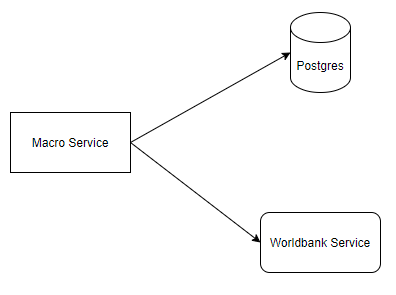
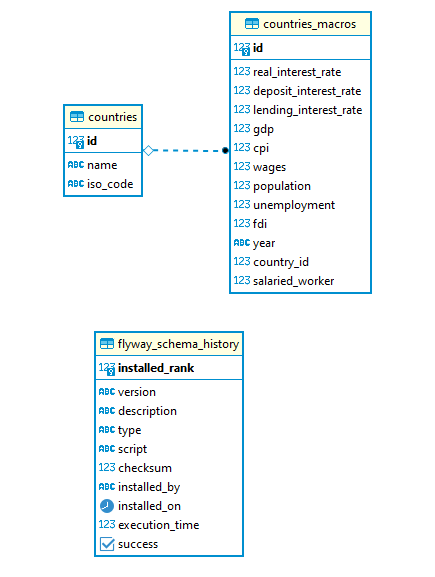

# Macro Service
## Description
the service is used to retrieve the macro informations of countries. Currently it stores the following information:
- real interest rate
- deposit interest rate
- lending interest rate
- gdp
- cpi
- population
- unemployment
- fdi
- year
- salaried worker

the service currently retrieve data from https://data.worldbank.org, api endpoint: api.worldbank.org

## High level diagram


## ER diagram


## How to
the current guide is assuming:
OS server: ubuntu
remote server ip: 
#### 1. run locally
```
gradle bootRun
open browser: localhost:8080
```
#### 2. deploy 
the script below will copy macro.jar, application.properties, run.sh to remote server
```
bash deploy.sh
```

#### 3.  run the service on the remote server from your local 
```
bash run-remotely.sh
```
